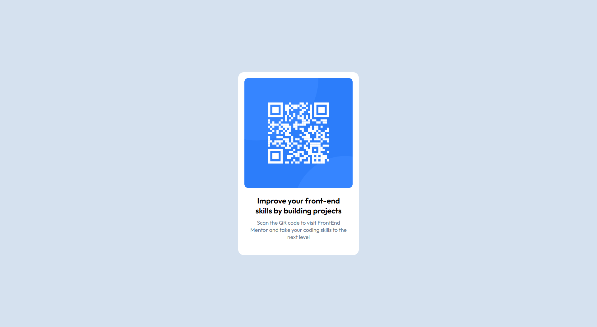

# Frontend Mentor - QR code component solution

This is a solution to the [QR code component challenge on Frontend Mentor](https://www.frontendmentor.io/challenges/qr-code-component-iux_sIO_H). Frontend Mentor challenges help you improve your coding skills by building realistic projects. 

## Table of contents

- [Overview](#overview)
  - [Screenshot](#screenshot)
  - [Links](#links)
- [My process](#my-process)
  - [Built with](#built-with)
  - [What I learned](#what-i-learned)
  - [Continued development](#continued-development)
- [Author](#author)


## Overview

### Screenshot




### Links

- Solution URL: [https://github.com/smartinez-t/Frontend-Mentor-QR-code-component]
- Live Site URL: [(https://smartinez-t.github.io/Frontend-Mentor-QR-code-component]

## My process

### Built with

- Semantic HTML5 markup
- CSS custom properties
- Flexbox


### What I learned

```html
<h1>Some HTML code I'm proud of</h1>
```
```css
.tarjeta { /* .tarjeta is the card container */
  width: 300px;
  height: 450px; 
  background: hsl(0, 0%, 100%);
  border-radius: 15px;
  display: flex;
  flex-direction: column;
  align-items: center;
  text-align:center;
  overflow: hidden; 
}

```
I feel proud because I practiced Flexbox
``


### Continued development

I’d like to keep practicing by creating layouts based on a picture or very specific requirements, because it helps me understand how each property affects the layout and how to achieve the expected result.

## Author

- Website - [Smartinez-t](https://github.com/smartinez-t)
- Frontend Mentor - [@smartinez-t](https://www.frontendmentor.io/profile/@smartinez-t)

